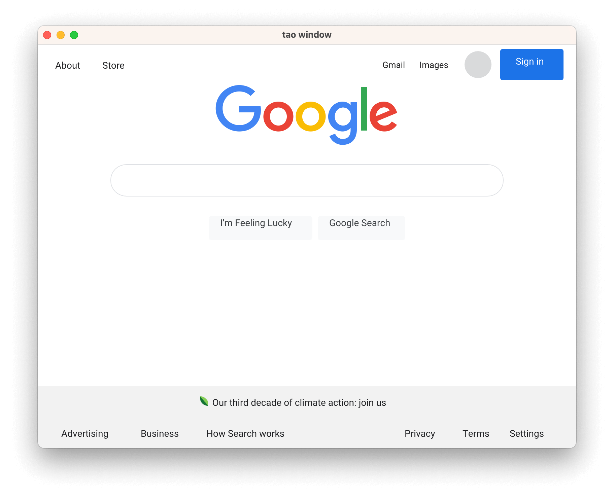

# Blitz: A lightweight, modular, extensible web renderer

Blitz is a "native" HTML/CSS renderer built to support the "Dioxus Native" project. It is effectively a lightweight webview except that the JavaScript engine is replaced with a native Rust API which allows Rust reactivity / state management libraries like Dioxus to interface with it directly.

Talk to us in: the #native channel in the [Dioxus Discord](https://discord.gg/v4mwT25E)

#### It currenly has two frontends:

- An HTML/markdown frontend that can render an HTML string. This is useful for previewing HTML and/or markdown files but currently lacks interactivity.
- A Dioxus frontend that can render a Dioxus VirtualDom. This has full interactivity support via Dioxus's event handling.

#### Blitz builds upon:

- [Stylo](https://github.com/servo/stylo) (Firefox's parallel browser-grade CSS engine) for CSS resolution
- [Vello](https://github.com/linebender/vello) + [WGPU](https://github.com/gfx-rs/wgpu) for rendering
- [Taffy](https://github.com/DioxusLabs/taffy) for box-level layout
- [Parley](https://github.com/linebender/parley) for text/inline-level layout
- [AccessKit](https://github.com/AccessKit/accesskit) for accessibility
- [Winit](https://github.com/rust-windowing/winit) for windowing and input handling

> Note: This repo contains a new version of Blitz which uses Stylo. The source code for the old version is still available on the [legacy](https://github.com/DioxusLabs/blitz/tree/legacy) branch but is not under active development.

## Screenshots

The Dioxus renderer:

The HTML renderer (rendering google.com):

## Trying it out

1. Clone this repo
2. Run an example:
    - `cargo run --example google`
    - `cargo run --example url https://myurl.com`
    - Other example available
    - Add `--release` for better runtime performance
3. Press `Ctrl/Cmd + +` / `Ctrl/Cmd + -` to change the scaling, press F1 to show layout rectangles

## Goals

Blitz is designed to render HTML and CSS - we *don't* want to support the entirety of browser features (or at least we want to make all such "extra" features opt-in). In our opinion, the browser is bloated for the basic usecase of rendering HTML/CSS.

We do intend to support:

- Modern HTML layout (flexbox, grid, table, block, inline, absolute/fixed, etc).
- Advanced CSS (complex selectors, media queries, css variables)
- HTML Form controls
- Accessibility using AccessKit
- Extensibility via custom widgets

Notably we *don't* provide features like webrtc, websockets, bluetooth, localstorage, etc. In a native app, much of this functionality can be fulfilled using regular Rust crates and doesn't need to be coupled with the renderer.

We don't yet have Blitz bindings for other languages (JavaScript, Python, etc) but would accept contributions along those lines.

## Architecture

Blitz is split into several pieces:
- `blitz-dom`: The core DOM abstraction that includes style resolution and layout but not drawing/painting. Combines the best of Stylo and Taffy that allows you to build extendable dom-like structures.
- `blitz`: Adds a Vello/WGPU based renderer to `blitz-dom`
- `dioxus-blitz`: A dioxus integration layer for blitz. Render your Dioxus app using Blitz. Currently `dioxus-blitz` also contains the HTML renderer but this will likely be split out into it's own package in future.

## Status

Blitz is currently **experimental**. We are actively working on bringing into a usable state but we would not yet recommend building apps with it.

### TODO

- [x] Core DOM tree abstraction
- [x] Parse styles using html5ever
- [x] Compute styles for html5ever document
- [x] Compute layout with Taffy
- [x] Render using WGPU

### Rendering

- [x] Render to window
- [x] Render to image
- [x] Gradients
- [x] Border/Outline
- [x] Raster images (png, jpeg, etc)
- [x] Zoom
- [ ] SVG
  - [x] External SVGs (basic support)
  - [ ] Inline SVGs
- [ ] Shadows
- [ ] Animations/Transitions
- [ ] Standard form controls (Checkbox/Dropdown/slider/etc)
- [ ] Custom widgets
- [ ] Shadow elements

### Layout

- [x] Inline (partial support - implementation still immature)
- [x] Block
- [x] Flexbox
- [x] Grid
  - [ ] Named grid lines
  - [ ] Subgrid
- [ ] Table
- [ ] Z-index
- [ ] Additional CSS features
   - [x] `box-sizing: content-box`
   - [ ] `calc()`
   - [ ] `position: static`
   - [ ] `direction: rtl`
   - [ ] `transform`

### Text

- [ ] Font loading
  - [x] System font loading
  - [ ] Web font loading
- [x] Text
  - [x] Shaping / Bidi
  - [x] Layout / line breaking
  - [x] Font size / line height
  - [x] Text color
  - [x] Bold / Italic
  - [x] Underline / Strikethrough
- [ ] Text selection

### Input

- [ ] Scrolling
  - [x] The root view
  - [ ] Any `overflow: scroll` element
- [x] Hover detection
- [x] Click handling
- [x] Text input

### Performance

- [x] Hot reloading
- [ ] Scrolling without re-resolving style and layout
- [ ] Style caching
- [ ] Layout caching

### Other

- [x] Multiwindow
- [x] Accessibility tree
- [x] Focus
- [ ] Devtools
- [ ] Hooks for context menu
- [ ] use_wgpu_context() to grab an element as an arbitrary render surface

## License

This project is dual licensed under the Apache 2.0 and MIT licenses

Unless you explicitly state otherwise, any contribution intentionally submitted for inclusion in stylo-dioxus by you, shall be licensed as MIT, without any additional terms or conditions.
