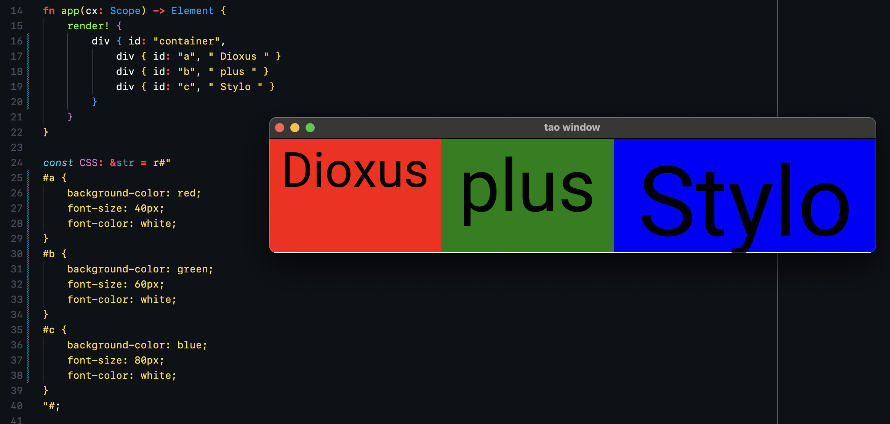

# Stylo-Blitz-demo

> A WIP native engine designed for [Dioxus](https://github.com/dioxuslabs/dioxus), intended to eventually become Blitz.



Render HTML and CSS using Firefox's parallel browser-grade CSS engine. Leverages:

- Stylo (servo/style) for CSS resolution
- Vello for drawing
- Glazier for input handling
- Taffy for Layout
- WGPU for rendering
- Shipyard for ECS data layout
- AccessibilityKit for accessibility

Built to support the Dioxus-Native project.

## Usage

```rust
fn main() {
    // Create a blitz document (similar to HTML document)
    let mut document = blitz::Document::new();

    // Modify its content via DOM methods
    document.set_inner_text(
        r#"<div class="bg-red-200 text-white text-large border"> Hello world! </div>"#
    );

    // Import arbitrary stylesheets
    document.add_stylesheet(r#"
        .bg-red-200 { background_color: #ff1234; }
        .text-white { text_color: #fffff; }
        .text-large { font_size: 16px; }
        .border { border_color: gray; }
    "#);

    // Render it however you want
    blitz::render_to_img(document, Options {
        viewport: Rect::new(800.0, 600.0),
        ..Default::default()
    });
}
```

## Playing around with it

1. Clone this repo
2. `cargo run --example example_name` (flex/border,outline) all work
3. Press arrow up/down to change scaling, press F1 to show layout rectangles

## Story

Way back in 2015, Mozilla released Rust to the world as a new systems programming language. Rust was designed to replace C++ in an aging and increasingly vulnerable Firefox. The tesbed for new browser components - and Rust itself - was the Servo project. Servo was meant to test exotic ideas like multithreaded rendering while vetting out changes to Rust itself. Since then, much has changed. Mozilla no longer stewards Rust and, in 2021, effectively cancelled the Servo project.

Recently, Servo was restarted by the team at Egalia. Many engineers from Mozilla still contribute to the Servo codebase and, remarkably, the styling engine in Servo is used officially by Firefox itself.

This project aims to fulfill the long-held dream of many Rustaceans that Servo could power a native GUI library for Rust. There's been tremendous discussion about the idea, but few have attempted an actual execution. Our goal is for Blsysitz to fulfill that goal, enabling anyone to easily render HTML and CSS.

## Goals

Blitz is designed to render HTML and CSS - we *don't* want to support the entirety of browser features. In our opinion, the browser is bloated for the basic usecase of rendering HTML/CSS.

- Lay out HTML using modern algorithms (grid, flex, table, absolute/fixed)
- Style HTML using CSS stylesheets
- Provide accessibility queries using AccessibilityKit

Notably we *don't* provide:
- A router
- Image fetching (you will need to preload these before attempting to render)
- Features like webrtc, websockets, bluetooth, localstorage, etc.

## Cross-language Bindings

We don't yet support Blitz bindings for other languages but would love help in getting our support for:
- [ ] JavaScript (WASM)
- [ ] JavaScript (node w/ threads)
- [ ] Python

## Architecture

Blitz is split into several pieces:
- blitz-resolve: an HTML/CSS layout and style resolution engine that *does* not include drawing. Combines the best of Taffy and Stylo for that allows you to build extendable dom-like structures.
- blitz: an engine that combines blitz-resolve with vello to enable browser-grade drawing

Blitz -> Document -> Renderer

## status
TODO:
- [x] Compute styles for html5ever document
- [x] Compute layout with Taffy
- [x] Compute styles for Dioxus Lazy Nodes
- [ ] Computing layout using resolved styles from stylo
- [x] Pass layout and styles to WGPU for single frame to png

- [x] Render to window
- [x] Frame
- [ ] gradient (figured out just not implemented)
- [x] Outline
- [x] Border
- [ ] Shadow
- [ ] Widgets
- [ ] Text selection / input
- [ ] Checkbox/slider/etc
- [ ] text (italic, bold, size, font, quote, color, selection color, rustybuzz/swash/shaping, l-r text etc)
- [ ] svg (lyon? vello?)
- [ ] Shadow elements
- [x] zoom (partially implemented, needs to be user controlled)
- [ ] zoom needs to shrink available UI space (for responsive stuff)

- [ ] Implement per-frame caching
- [ ] Text
- [ ] Font loading + detection
- [ ] quadtree
- [ ] bezpaths
- [ ] scene
- [ ] layout


- [ ] Add interactivity (hit testing, etc etc)
- [ ] scrolling
- [ ] Druid shell (glazier) for native text selection (and a whole host of other stuff...)
- [ ] I think we can just add nstext directly
- [ ] Hooks for context menu
- [ ] keyboard input, event bubbling etc

- [ ] Render a webview https://github.com/tauri-apps/wry/issues/677
- [ ] Devtools
- [ ] Add accessibility kit
- [x] Multiwindow
- [ ] Animation
- [ ] use_wgpu_context() to grab an element as an arbitrary render surface
- [ ] Tests
- [ ] Profiler
- [ ] hot reloading

- We might want to migrate to servo's layout engine once it's released

## License

This project is licensed under the MIT license.

Unless you explicitly state otherwise, any contribution intentionally submitted for inclusion in stylo-dioxus by you, shall be licensed as MIT, without any additional terms or conditions.
